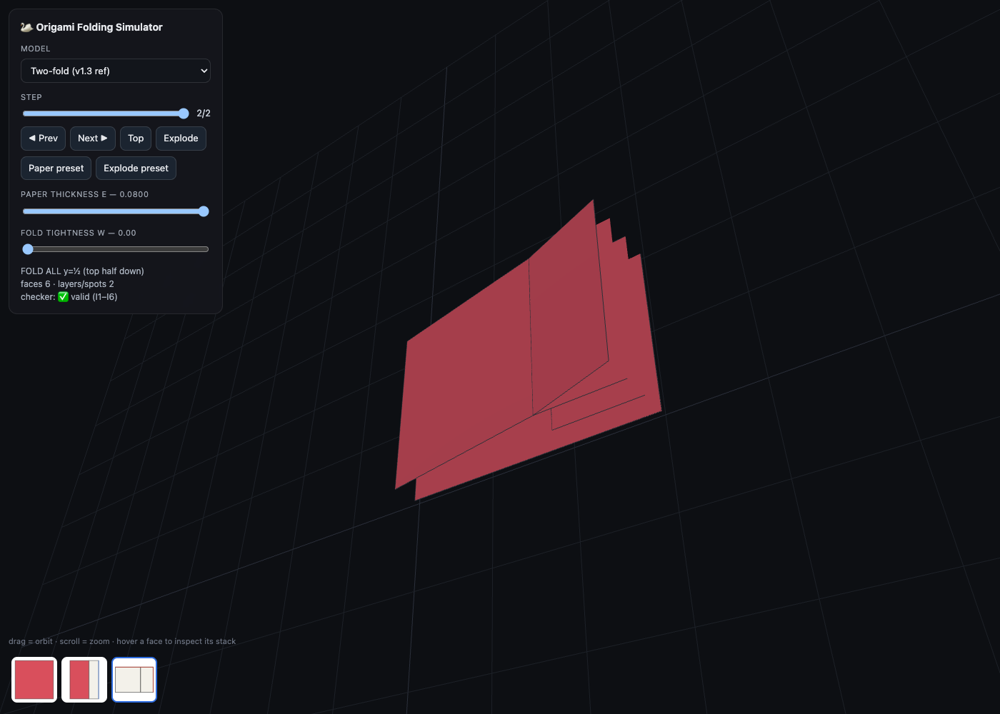
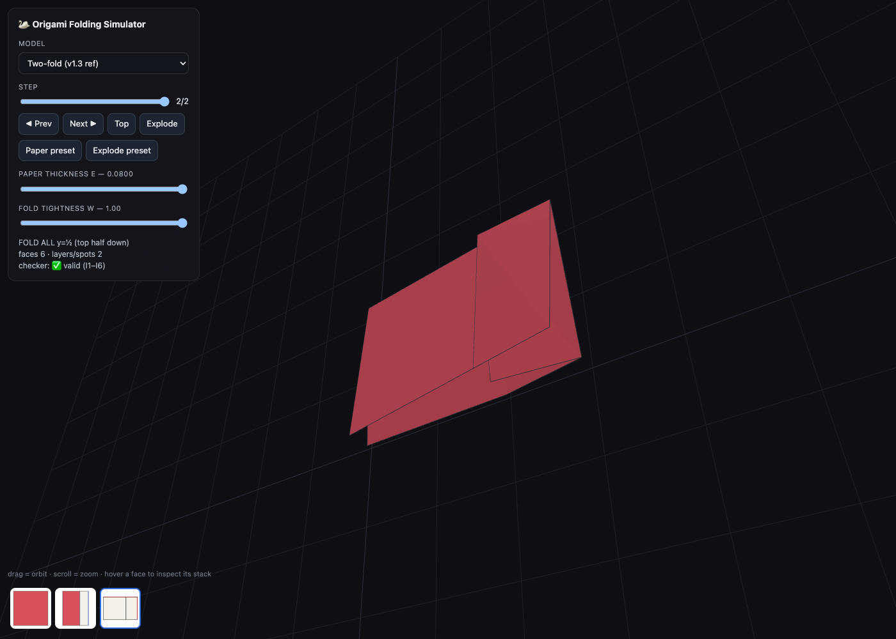

# Viewer §8.1 v1.3 — height welding

The viewer computes a continuous height field `V(state; ε, w)` over the same layer data;
the split is bookkeeping, not physics, so the render is C0-continuous across every SPLIT
edge. No fold-angle poses, no fold-tree — pure per-`(face, vertex)` z.

- **Base height** `z(face) = (stack index within its spot) × ε` (no global topo sort).
- **Two-tier weld**, per folded-space vertex position:
  - SPLIT edges weld **unconditionally** (mean) — a facet draping over an underlying
    stack becomes one continuous ramp.
  - folded CREASE edges weld by hinge cluster, blended `z = (1−w)·own + w·mean`.
  - coincident-but-**unattached** instances (separate stacked flaps) are never merged.
- **Conforming triangulation**: neighbour vertices on a face edge are inserted (T-junction
  resolution) so adjacent pieces share vertices — no hairline cracks.
- **Edge lines**: BOUNDARY + folded CREASE only; **SPLIT edges are never drawn**. No hinge walls.
- **Presets**: Paper (`w=1, ε=0.004`, explode off — default) and Explode.

## Reference two-fold state (spec §8.1 item 7)

Square folded twice (flap at x=¾, then top half down). The base sheet's top half is ONE
facet: 2 layers over `[0,½]`, 4 over `[½,¾]`. It must ramp, not break into plates.

| `w = 0` (naive per-face plates) | `w = 1` (v1.3 welded — facet stays whole, ramps) |
|---|---|
|  |  |

## Acceptance at the Paper preset (top-orthographic, `w=1 ε=0.004`)

Clean solid silhouette matching Π(S); no cracks; no visible SPLIT lines.

| Half / half again | Traditional cup | Golden #8 (house) |
|---|---|---|
|  |  |  |

Fold-angle poses / fold-tree = Phase D (out of scope here). Fold animation is deferred
(forward step snaps to the committed state).
