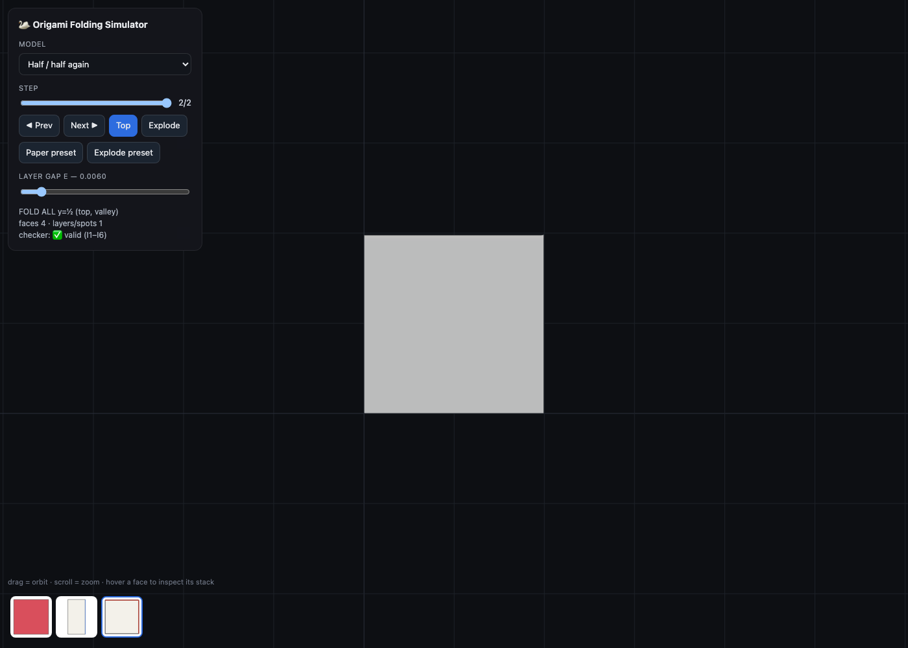
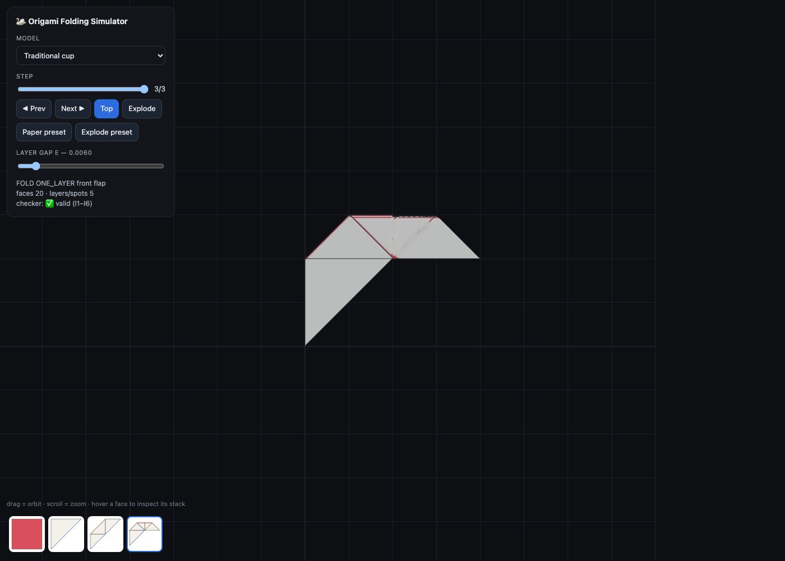
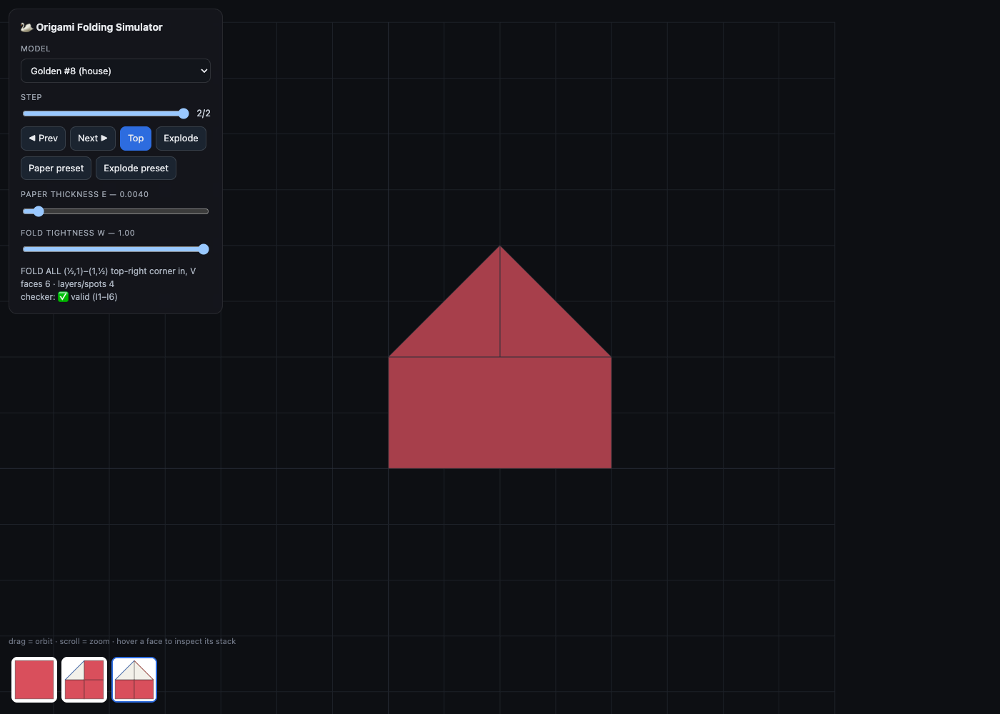

# Viewer §8.1 — the engine places the paper, the renderer rounds off the joins

`V(state; ε)` draws the layer model as it is: a face at its exact folded polygon, at the height
its index in its own spot's stack gives it. No fold-angle poses, no fold-tree in the state, and
nothing simulated at render time either — **every point of paper more than a join's width from a
join is at exactly `T(p)` and exactly `level × ε`, to the last decimal.** The top view is Π(S)
by construction rather than by luck.

What the renderer adds is the one thing flat plates cannot show: where two faces are JOINED,
paper turns instead of stopping. A narrow band of material either side of each join is lifted
onto a curve.

- **One mesh, in material space, conforming by construction.** The source square is cut into
  convex cells by every face boundary, so no triangle straddles a join; refinement marks EDGES
  and splits each triangle by how many of its edges are marked, so no neighbour is left with a
  vertex hanging in the middle of its edge. Sizing is graded — fine on a join, coarsening away
  from one. Because it is ONE surface there is nothing to stitch: the seams, corner walls,
  T-junctions and hollow hinges that the v1.3/v1.4 assembly of slabs, ribbons and caps kept
  producing cannot arise.
- **A CREASE becomes a U-turn.** The two layers it joins lie on the same side of the crease
  line, Δz apart, so the paper doubles back: a semicircle of radius Δz/2 whose ends leave both
  layers tangentially, drawn from π·Δz/4 of material on each side. Each turn is centred **one
  own radius in** from the fold line, so its rim lands exactly ON that line — every layer's
  folded edge reaches the line, whatever else is folded there. (Centring a turn on the widest
  turn ENCLOSING it gives concentric layers, truer to real paper, but sets each inner rim back
  by the difference of the radii — 3ε on the cup — and that reads as the outer layer wrapping
  round the side of the stack while the inner fold stops short. Shipped once; removed. The cost
  of the flush rims is the other way round: an inner turn can now cross the arc of the one that
  used to enclose it, strictly inside the pile.)
- **Height is ONE FIELD over the material.** Every face pulls the sheet toward its own level
  with a reach of its deepest join; the height at a point is the weighted average of the faces
  that reach it — the engine's level deep inside a face, the midpoint at a crease, a smooth
  spiral where creases cross. Summing per-face corrections instead tears the sheet: near a
  crossing, the two faces meeting at a crease correct toward different third faces and disagree
  by ε on the edge they share (118× area on one cup triangle). The weight has to reproduce the
  U-turn's own height profile, `w = (1−s)/(1+s)`, `s = sin(π·d/2δ)`; a smoothstep stalls at the
  crease and crushes the paper into the fold by 300×. The turn's sideways lean fades out where
  a crease ends inside the paper, so a crossing goes crisp rather than fighting itself.
- **A SPLIT with a level change becomes a drape.** One sheet crossing the edge of the pile
  beneath it stays flat on the pile up to the cut and falls away beyond it on an S-curve that
  leaves both levels flat. A facet legitimately spans many levels — in the cup, 0 to 6 — and
  CONF cuts it exactly where the level changes, so the engine says precisely where this happens.
- **The band's material is reparametrised onto the curve; it does NOT preserve length.** That
  is the point. The v1.5 build folded the sheet the way paper actually folds — arcs consuming
  material, layers ending short by what they spent going round — and every quantity then
  depended on every other: layers drifted from where the engine put them, the drift accumulated
  fold over fold, flat paper strained at corners, and pinning any one of them broke another. A
  stack of layers with THICKNESS genuinely cannot fold flat; the material does not add up.
  Letting a few millimetres of paper stretch inside a bend buys back exactness everywhere else,
  and nothing outside the band can tell.
- **Two skins, one surface**: the sheet's normal genuinely turns over where the paper does, so
  `FrontSide` always shows the square's +z side and `BackSide` the other — the two colours
  follow the paper around every fold with nothing to keep in sync.
- **Edge lines**: BOUNDARY + folded CREASE only, drawn as chains of MESH edges so they lie on
  the surface and follow every curve they cross; **SPLIT edges are never drawn**. Hidden lines
  need no policy — the paper occludes them.
- **A join never claims more than a small fraction of the paper** (4 % of the square, a third
  of its face). The flat plates ARE the model — a face has to read as a stiff flat sheet at the
  height the engine gave it — and without the cap the bands grow with ε until Explode turns
  every face into one continuous blob. When the cap cannot hold a turn, that turn is drawn at
  the reduced scale its own band holds — a narrow ribbon instead of a loop swinging past the
  fold line.
- **One parameter**: `ε`, the layer gap (default 0.006). A separate hinge-radius knob is a
  contradiction, not a parameter: demanding radius R forces the layers it joins 2R apart, which
  *is* the gap. **Explode** bounds the whole STACK, not just the gap (`ε ≤ 0.12/depth`): one
  sheet runs from level 0 to level 6, so every layer of separation is a wall that sheet has to
  climb, and spread far enough it stops reading as paper.

## Acceptance — measured, not eyeballed

`packages/viewer/test/mesh.test.ts`, every golden model × {paper, exploded, thin}. The renderer
reports which vertices it left alone (`Built.settled`), so the tests check its own claim rather
than guess at band widths:

| check | what it catches |
|---|---|
| the render IS the verified state | every settled vertex at the engine's exact position, within float32 |
| unbroken surface | a T-junction from refinement — open edges only on the square's outline |
| layer height | every face drawn at exactly its stack index × ε |
| no stretching outside a join | any curve that leaked out of its band |
| the paper does not crumple | triangle AREA vs its area on the flat square — a shear that keeps every edge length but spikes the triangle |
| the rounding stays local | a "pretty" curve quietly becoming the model |
| animation | t = 1 reproduces the committed build exactly |

## At the Paper preset (top-orthographic, ε = 0.006)

Silhouette matches Π(S); no cracks; no visible SPLIT lines. The paper reads **back-coloured**
from above, as §8.1 requires and as the retired build got wrong: after a valley fold the flap
shows its back, and the whole cup is back-coloured.

| Half / half again | Traditional cup | Golden #8 (house) |
|---|---|---|
|  |  |  |

`two-fold-w0-naive.png` / `two-fold-w1-welded.png` document the v1.3 vertex weld (`w`), retired
with the facet construction itself; they are kept only as a record of why per-face plates fail.

Fold-angle poses / fold-tree = Phase D (out of scope here). Fold animation is `setProgress` on
this same mesh: the last fold's movers swing 0 → π and the join curves are blended in over the
same interval, ending exactly on the committed state.
